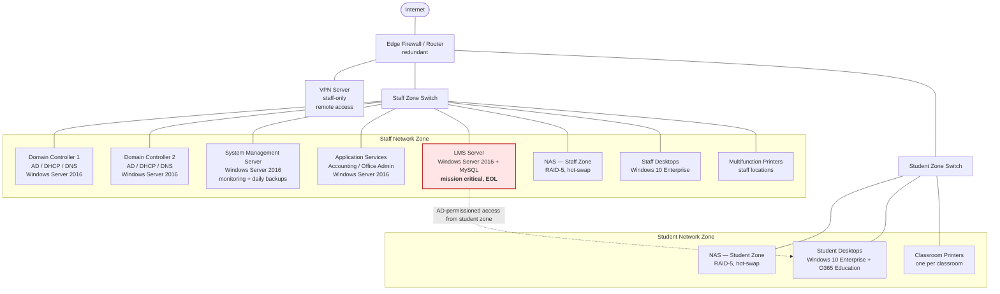

# YAT College — On-Prem Network Diagram

**Relevant to:** S1-CL1 AT1, AT2, AT3

**UoC references this document satisfies:**
- [ICTICT517 AC 5] Information on current ICT systems and practices in the organisation including operating systems, hardware, and security
- [ICTCLD502 PC 2.1] Review architecture of traditional multi-tier web application in non-cloud environment and identify high availability requirements
- [ICTCLD502 PC 2.2] Identify any single points of failure

**Source status:** ✅ Complete — text representation below derived from the narrative description in `internal-ict-environment-overview-S1-CL1-AT1.md` (verbatim YAT content). Mermaid diagram is Claude-authored — **TBD** confirm topology assumptions before final publication. Original YAT image still needs re-rendering as PNG/SVG for the mock-intranet UI.

---

## Network topology

## Component summary

| Component | Zone | Redundancy | Notes |
|---|---|---|---|
| Edge router/firewall | (perimeter) | Redundant | No single point of failure at network plumbing layer |
| VPN server | (perimeter) | **Single — SPOF** | Staff-only remote access |
| Domain Controllers (x2) | Staff | Redundant (load-shared, no single-system outage) | AD / DHCP / DNS; serve both zones |
| System management server | Staff | Single — non-critical | Runs daily backups for both zones |
| Application services server | Staff | Single — outsourced critical functions | Accounting + office admin |
| **LMS server** | **Staff** | **Single — SPOF, EOL, mission critical** | **Migration target — see `internal-lms-server-status-S1-CL1-AT1.md`** |
| NAS — Staff zone | Staff | RAID-5 (disk-level only) | Currently not considered mission critical |
| NAS — Student zone | Student | RAID-5 (disk-level only) | Currently not considered mission critical |
| Staff desktops | Staff | n/a | Windows 10 Enterprise, AD-joined |
| Student desktops | Student | n/a | Windows 10 Enterprise + O365 Education |
| Multifunction printers | Staff | n/a | High-performance, designated locations |
| Classroom printers | Student | n/a | One per classroom |

## Single points of failure flagged for the migration

- **LMS server** — single instance, end of life, mission critical → primary migration target
- **VPN server** — single instance providing all staff remote access; not currently in scope for the LMS migration but worth noting
- **Application Services server** (Accounting/Office Admin) — single instance; partially mitigated by outsourcing the critical functions (e.g. pay runs)
- **System Management server** — single instance; explicitly tagged as not requiring HA

---

**Still needed:**
- Re-render as a published PNG / SVG for use on the mock intranet UI (the Mermaid above renders inline in most markdown viewers but won't display in all intranet platforms).
- Confirm topology details with Tim — particularly the edge firewall redundancy assumption and the VPN-as-SPOF observation (YAT source says "no SPF" on the network infrastructure layer but explicitly says "A single VPN server").
